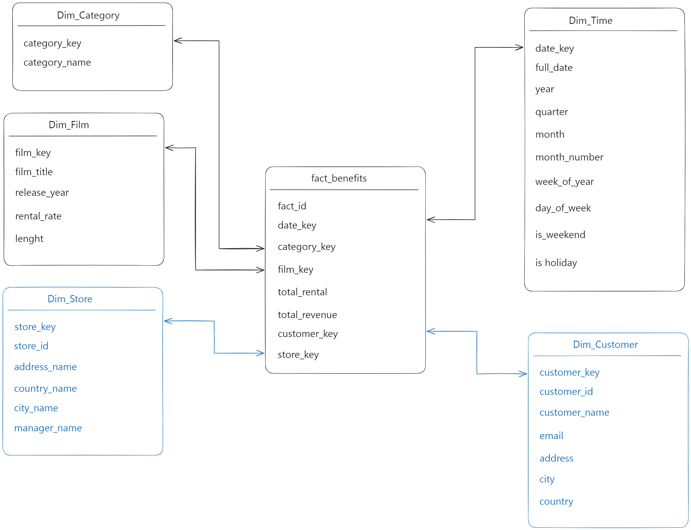
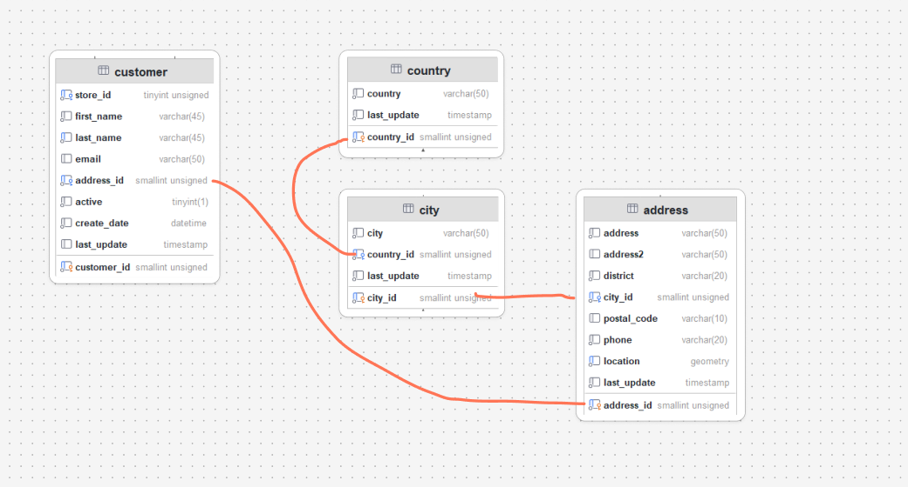

# Tabla de hechos: beneficios por categoría por día.

El objetivo de esta tabla de hechos es consultar los datos sobre los **beneficios obtenidos por categoría por día**, aunque puede llegar a ser lo suficiente flexible para hacer otro tipo de consultas agregando más dimensiones. 

Para evitar problemas con la base de datos original hice una nueva base de datos llamada `sakila_star` y comencé a trabajar desde ahí. 

## **1. Definición de la Tabla de Hechos**

La tabla de hechos contendrá los datos enlazados de las tablas de sakila necesarias que son:

- film
    - title: nombre de la pelicula
    - release_year: fecha de lanzamiento
    - rental_rate: precio del alquiler
- category
    - category_id
    - category_name
- tabla nueva llamada `dim_time`: para mostrar los diferentes detalles sobre las fechas de los ingresos.
    - date_key: Clave única para la fecha (formato AAAAMMDD)
    - full_date: Fecha completa
    - year : columna del año
    - quarter: Trimestre (Ej. Q1, Q2…)
    - month: Nombre del mes
    - month_number: Número del mes
    - week_of_year: Semana del año
    - day_of_week: Nombre del día
    - is_weekend: Indica si es fin de semana
    - is_holiday: Indica si es un día festivo

Con estas columnas de sakila vamos a formar las dimensiones que necesitamos

## Tabla de dimensiones

- Dim_Category
- Dim_Film
- Dim_Time

## Tabla de hechos

La tabla se llamará `Facts_benefits` que tendrá las siguientes columnas 

- fact_id (PK): Identificador único
- date_key (FK) : Clave foránea de la dimensión tiempo (`Dim_Time`)
- category_key (FK): Clave foránea de la dimensión categoría (`Dim_Category`)
- film_key: Clave foránea de la dimensión película (`Dim_Film`)
- total_rental: Total de alquileres, número de veces que la película fue alquilada
- total_revenue: Beneficio total generado por la película en esa fecha

### Esquema del modelo estrella básico.

Cada dimensión contiene información detallada que se podrá mostrar en la tabla `Fact_benefits` 

En siguiente **esquema** se muesrtra cómo se vería el modelo estrella enlazando las tablas dimensionales con la tabla de hechos `Fact_benefits`


# Creación de tablas SQL

Una vez visto el esquema y teniendo claro las columnas que necesitamos podemos proceder a la creación de tablas en **MySQL**.  

El siguiente bloque SQL se muestran las tablas `Dim_Time`, `Dim_Category`, `Dim_Film`

```sql
CREATE TABLE Dim_Time (
    date_key INT PRIMARY KEY,
    full_date DATE,
    year INT,
    quarter VARCHAR(5),
    month VARCHAR(15),
    month_number INT,
    week_of_year INT,
    day_of_week VARCHAR(15),
    is_weekend BOOLEAN,
    is_holiday BOOLEAN
);

CREATE TABLE Dim_Category (
    category_key INT PRIMARY KEY AUTO_INCREMENT,
    category_name VARCHAR(50) UNIQUE NOT NULL
);

CREATE TABLE Dim_Film (
    film_key INT PRIMARY KEY AUTO_INCREMENT,
    film_title VARCHAR(255) NOT NULL,
    release_year YEAR,
    rental_rate DECIMAL(4,2),
    length INT
);

```

## Creamos la tabla de hechos: `Fact_benefits`

Una que tenía las tablas dimensionales creadas procedí a crear la tabla de hechos. 

 

```sql
CREATE TABLE Fact_Benefits (
    fact_id INT PRIMARY KEY AUTO_INCREMENT,
    date_key INT,
    category_key INT,
    film_key INT,
    total_rental INT,
    total_revenue DECIMAL(10,2),
    FOREIGN KEY (date_key) REFERENCES Dim_Time(date_key),
    FOREIGN KEY (category_key) REFERENCES Dim_Category(category_key),
    FOREIGN KEY (film_key) REFERENCES Dim_Film(film_key)
);
```

## Carga de datos desde Sakila

Comenzamos con `Dim_Time`, esta tabla es un poco más engorrosa ya que se debe insertar datos necesarios de fechas que se encuentra en la tabla `sakila.rental` y sacar las semanas del año, nombre del día, nombre del mes, etc.. **MySQL tiene funciones propias** que nos ayuda a cargar los datos que necesitamos como son: 

- MONTHNANME: Obtiene el nombre del mes
- WEEKOFYEAR: Obtiene el número de la semana del año
- DAYNAME: Obtiene el nombre del día de la semana
- DAYOFWEEK: Obtiene el número de día de la semana

Esta es la carga para `Dim_Time`

```sql
INSERT INTO Dim_Time (date_key, full_date, year, quarter, month, month_number, week_of_year, day_of_week, is_weekend, is_holiday)
SELECT DISTINCT 
    DATE_FORMAT(rental_date, '%Y%m%d') AS date_key, 
    DATE(rental_date) AS full_date,
    YEAR(rental_date) AS year, 
    CONCAT('Q', QUARTER(rental_date)) AS quarter,
    MONTHNAME(rental_date) AS month, 
    MONTH(rental_date) AS month_number,
    WEEKOFYEAR(rental_date) AS week_of_year, 
    DAYNAME(rental_date) AS day_of_week,
    CASE WHEN DAYOFWEEK(rental_date) IN (1,7) THEN 1 ELSE 0 END AS is_weekend, 
    0 AS is_holiday
FROM sakila.rental
GROUP BY date_key, full_date, year, quarter, month, month_number, week_of_year, day_of_week, is_weekend;
```

Para las 2 siguientes dimensiones es bastante más fácil simplemente de 2 y 4 columnas 

```sql
-- Poblar la dimension categoria
INSERT INTO Dim_Category (category_name)
SELECT DISTINCT name FROM sakila.category;

-- Poblar la dimension pelicula
INSERT INTO Dim_Film (film_title, release_year, rental_rate, length)
SELECT DISTINCT f.title, f.release_year, f.rental_rate, f.length
FROM sakila.film f;
```

### Carga de datos en tabla de hechos

En `INSERT` comenzamos nombrando todas las columnas donde vamos a insertar, luego en `SELECT` seleccionamos aquellas columnas que necesitamos. En `total_rental` usamos la operación de `COUNT` para contar todas las filas que aparezca esa película que se ha alquilado ese día. Con `SUM` sumamos el total de beneficio del día  por película ese día. 

```sql
INSERT INTO
    Fact_Benefits (
        date_key,
        category_key,
        film_key,
        total_rental,
        total_revenue
    )
SELECT
    dt.date_key,
    dcat.category_key,
    dfilm.film_key,
    COUNT(*) AS total_rental,
    SUM(p.amount) AS total_revenue
FROM
    sakila.rental r
    JOIN sakila.inventory i ON r.inventory_id = i.inventory_id
    JOIN sakila.film f ON i.film_id = f.film_id
    JOIN sakila.film_category fc ON f.film_id = fc.film_id
    JOIN sakila.category c ON fc.category_id = c.category_id
    JOIN sakila.payment p ON r.rental_id = p.rental_id
    JOIN Dim_Time dt ON dt.full_date = DATE(r.rental_date)
    JOIN Dim_Category dcat ON dcat.category_name = c.name
    JOIN Dim_Film dfilm ON dfilm.film_title = f.title
GROUP BY
    dt.date_key,
    dcat.category_key,
    dfilm.film_key;
```

# Validación de datos.

Una vez que hemos insertado todos los datos podemos proceder a validar y hacer consultas para ver los resultados. 

### Ingresos totales por categoría y mes:

Esta consulta muestra **cuánto se ha ingresado por cada categoría por mes**, sumando `total_revenue` y agrupamos por la dimensión de tiempo y la dimensión de categoría

```sql
SELECT
    c.category_name,
    t.year,
    t.month,
    SUM(fb.total_revenue) AS total_revenue
FROM Fact_Benefits fb
JOIN Dim_Time t ON fb.date_key = t.date_key
JOIN Dim_Category c ON fb.category_key = c.category_key
GROUP BY
    c.category_name,
    t.year,
    t.month
ORDER BY
    t.year,
    t.month,
    c.category_name;
```


### Cantidad de alquileres (total_rental) por Película y Año

Con esta consulta podemos saber cuantas veces fue alquilada cada película en un año.  Ya que sólo tenemos datos de 2005 se mostrará solo ese año, pero obtenemos los alquileres de cada Película, que es el dato importante. 

```sql
SELECT 
    t.year,
    f.film_title,
    SUM(fb.total_rental) AS total_rentals
FROM Fact_Benefits fb
JOIN Dim_Time t ON fb.date_key = t.date_key
JOIN Dim_Film f ON fb.film_key = f.film_key
GROUP BY 
    t.year,
    f.film_title
ORDER BY 
    t.year,
    total_rentals DESC;
```


### Top 10 Películas más Alquiladas

Para ello, hacemos SUM de `total_revenue` agrupando `Dim_Film.film_title` y ordenamos de forma descendente para que salga la suma mas alta primero. 

```sql
SELECT
    f.film_title,
    SUM(fb.total_revenue) AS total_revenue
FROM Fact_Benefits fb
JOIN Dim_Film f ON fb.film_key = f.film_key
GROUP BY
    f.film_title
ORDER BY
    total_revenue DESC
LIMIT 10;
```

### Comparación de ingresos por Trimestre en un Año dado o en todos

Esta última es muy parecida, pero esta vez, se puede aprovechar la columna `quarter` de `Dim_Time` para sacar los beneficios obtenidos por quatrimestre. 

```sql
SELECT
    t.year,
    t.quarter,
    SUM(fb.total_revenue) AS revenue_per_quarter
FROM Fact_Benefits fb
JOIN Dim_Time t ON fb.date_key = t.date_key
-- WHERE t.year = 2005 -- Podemos filtrar por año
GROUP BY
    t.year,
    t.quarter
ORDER BY
    t.quarter;
```

Si filtramos por año 2005


Si no filtramos y mostramos todos los quatrimestres de 2005 y 2006


### Análisis de Fechas (Días de semana vs Fin de semana)

De esta manera podemos saber los ingresos que se han obtenido entre semana y en el fin de semana. 

```sql
SELECT
    CASE WHEN t.is_weekend = 1 THEN 'Fin de Semana' ELSE 'Día de Semana' END AS day_type,
    SUM(fb.total_revenue) AS total_revenue
FROM Fact_Benefits fb
JOIN Dim_Time t ON fb.date_key = t.date_key
GROUP BY
    day_type;
```

Resultado


### Ingresos obtenidos en los dias marcados como vacaciones.

En un principio, no hay ningún día marcado como vacaciones, que se representa `Dim_Time.isHoliday = 1` . Por eso he modificado la semana de Junio marcandola como semana de vacaciones cambiando en `is_holiday` a `1` . La consulta se ve de la siguiente manera

```sql
SELECT 
    t.full_date,
    SUM(fb.total_revenue) AS total_revenue
FROM Fact_Benefits fb
JOIN Dim_Time t ON fb.date_key = t.date_key
WHERE t.is_holiday = 1
GROUP BY t.full_date
ORDER BY t.full_date;
```


Si queremos el total de todas las vacaciones simplemente tenemos que comentar dos líneas


# Para terminar

La estructura de la tabla de hechos está a nivel de `fecha-categoria-pelicula` . Se podría obtener más detalles uniendo también las tiendas (Store) o cliente (customer) o trabajadores (staff). Cuanto mas granular sea la tabla, mayor volumen de datos, pero mayor detalle para el análisis. 

Entonces podemos decir que otras dimensiones que se pueden agregar serían:

- Dim_Store
- Dim_Staff
- Dim_Customer


# ✏️ Actualización 05-01-25: Agregados Dim_Customer, Dim_Store

En los siguientes pasos se muestran los pasos para la creación de las tablas dimensionales `Dim_Cusyomer` y `Dim_Store` que añaden más granularidad al modelo estrella consiguiendo así más detalles importantes, como puede ser beneficios por tienda, qué clientes ha alquilado más en ciertas fechas, en que ciudades se ha alquilado más, etc…

El repositorio de [Github](https://github.com/thorcazo/sakila_star) también ha sido actualizado. con las tablas, alteraciones, inserciones y consultas nuevas. 



## Creando Dim_Customer

En este paso vamos a crear la nueva dimensión `Dim_customer` que nos servirá para obtener los datos de los clientes. Con ella vamos a obtener las siguientes columnas

- customer_key
- customer_id
- customer_name
- email
- address_name
- city_name
- country_name

Estos datos se tiene que obtener de distintas tablas. En la siguiente captura se puede observar de dónde se ha obtenido cada dato que necesitamos para poder completar`Dim_Customer` 



### Tabla de `Dim_Customer`

La nueva tabla va a almacenar los datos del cliente y otros datos como el nombre de la ciudad, nombre país, dirección que no aparece directamente en la tabla `sakila.customer` por  lo que es necesario, después en la inserción, realizar distintos `JOIN` para obtener los datos 

```sql
CREATE TABLE Dim_Customer (
    customer_key INT PRIMARY KEY AUTO_INCREMENT,
    customer_id INT,
    customer_name VARCHAR(255),
    email VARCHAR(255),
    address VARCHAR(255),
    city VARCHAR(100),
    country VARCHAR(100)
);
```

### Vinculando la tabla `Dim_Customer` con la tabla de hechos

Como ya tenemos las tablas creadas debemos utilizar `ALTER` para agregar la columna `customer_key` que hace referencia a `Dim_Customer.customer_key` 

```sql
-- MODIFICACIONES en Fact_Benefits para agregar la llave foranea de la tabla Dim_Customer
ALTER TABLE Fact_Benefits
ADD COLUMN customer_key INT AFTER film_key;

ALTER TABLE Fact_Benefits
ADD CONSTRAINT fk_customer FOREIGN KEY (customer_key) REFERENCES Dim_Customer (customer_key);
```

### Poblando `Dim_Customer`

Una vez que ya tenemos la tabla `Dim_Customer` creada y hemos realizado la ALTERACIÓN en la tabla de hechos `Fact_Benefits` podemos comenzar a poblar las tablas de nuevo. 

```sql
INSERT INTO
    Dim_Customer (
        customer_id,
        customer_name,
        email,
        address,
        city,
        country
    )
SELECT c.customer_id, CONCAT(
        c.first_name, ' ', c.last_name
    ) AS customer_name, c.email, a.address, ci.city, co.country
FROM
    sakila.customer c
    JOIN sakila.store s ON s.store_id = c.store_id
    JOIN sakila.address a ON a.address_id = c.address_id
    JOIN sakila.city ci ON ci.city_id = a.city_id
    JOIN sakila.country co ON co.country_id = ci.country_id;
```

### Repoblando `Fact_Benefits`

Actualmente la tabla de hecho está definida con una granularidad agrupada en fecha, categoría  y película. Si se quiere saber qué cliente realizó el alquiler se debe modificar la tabla de hechos como hemos realizado antes con `ALTER` . 

He optado por utilizar `TRUNCATE`, de esta manera borro todos los registros pero mantengo la estructura y luego vuelvo a  insertar de nuevo.

En el caso de que `Fact_Benefits` tuviera millones y millones de registros, se podría utilizar la método de `tablas staging (temporales)` donde se crea una copia de la tabla de hechos con las nuevas columnas necesarias, luego se pobla de nuevo, y se renombra la tabla staging (hacer un swap) como la principal y la original se elimina.

Ejemplo:  

```sql
-- Se renombra la tabla actual de hechos y la staging para que la staging pase a ser la nueva tabla de hechos.
RENAME TABLE Fact_Benefits TO Fact_Benefits_old,
             Staging_Fact_Benefits TO Fact_Benefits;

-- Si todo es correcto, se puede eliminar la tabla antigua.
DROP TABLE Fact_Benefits_old;
```

## Creación tabla `Dim_Store`

### Consulta de prueba

Para saber qué datos debemos insertar antes vamos a realizar una consulta de prueba 

```sql
SELECT
    st.store_id,
    ad.address as address_name,
    country.country as country_name,
    ct.city as city_name,
    country.country as country_name,
    CONCAT(
        staff.first_name,
        " ",
        staff.last_name
    ) as manager_name
FROM
    sakila.store st
    JOIN sakila.address ad ON st.address_id = ad.address_id
    JOIN sakila.city ct ON ad.city_id = ct.city_id
    JOIN sakila.country country ON ct.country_id = country.country_id
    JOIN sakila.staff staff ON st.manager_staff_id = staff.staff_id
```

Resultado de la consulta


### Tabla Dim_Store

```sql
CREATE TABLE Dim_Store (
    store_key INT PRIMARY KEY AUTO_INCREMENT,  -- Clave surrogate
    store_id INT,                               -- Identificador natural de la tienda
    address_name VARCHAR(255),
    city_name VARCHAR(100),
    country_name VARCHAR(100),
    manager_name VARCHAR(255)
);
```

### Alteramos `Fact_Benefits`

El siguiente paso es alterar la tabla para agregar la nueva columna que hace referencia a `Dim_Store`

```sql
ALTER TABLE Fact_Benefits 
    ADD COLUMN store_key INT AFTER customer_key;

ALTER TABLE Fact_Benefits 
    ADD CONSTRAINT fk_store FOREIGN KEY (store_key) REFERENCES Dim_Store(store_key);

```

### TRUNCAMOS `Fact_Benefits`

```sql
TRUNCATE TABLE `Fact_Benefits`;
```

### Volvemos a poblar `Fact_Benefits`

```sql
INSERT INTO Fact_Benefits (
    date_key,
    category_key,
    film_key,
    customer_key,
    store_key,
    total_rental,
    total_revenue
)
SELECT
    dt.date_key,
    dcat.category_key,
    dfilm.film_key,
    dc.customer_key,
    ds.store_key,              -- Nueva columna agregada
    COUNT(*) AS total_rental,
    SUM(p.amount) AS total_revenue
FROM
    sakila.rental r
    JOIN sakila.inventory i ON r.inventory_id = i.inventory_id
    JOIN sakila.film f ON i.film_id = f.film_id
    JOIN sakila.film_category fc ON f.film_id = fc.film_id
    JOIN sakila.category c ON fc.category_id = c.category_id
    JOIN sakila.payment p ON r.rental_id = p.rental_id
    JOIN Dim_Time dt ON dt.full_date = DATE(r.rental_date)
    JOIN Dim_Category dcat ON dcat.category_name = c.name
    JOIN Dim_Film dfilm ON dfilm.film_title = f.title
    JOIN Dim_Customer dc ON dc.customer_id = r.customer_id
    JOIN sakila.staff s ON r.staff_id = s.staff_id
    JOIN Dim_Store ds ON ds.store_id = s.store_id
GROUP BY
    dt.date_key,
    dcat.category_key,
    dfilm.film_key,
    dc.customer_key,
    ds.store_key;

```

# Consultas

**Consulta 1: Ingresos Totales por Tienda**
Esta consulta te permite conocer cuáles son las tiendas que generan mayores ingresos
(suponiendo que en tu tabla de hechos se almacena un campo, por ejemplo, payment_amount,
que representa el ingreso por cada alquiler).

```sql
SELECT st.store_key, manager_name, SUM(total_revenue) 
FROM `Fact_Benefits` fb
JOIN `Dim_Store` st on fb.store_key = st.store_key
GROUP BY st.store_key; 
```

**Consulta 2: Top 10 Clientes con Mayor Número de Alquileres**
Esta consulta muestra cuáles son los clientes (dimensión Customer) que han realizado más transacciones de alquiler.

```sql
SELECT 
    dc.customer_name,
    SUM(fb.total_rental) AS total_rentals
FROM Fact_Benefits fb
JOIN Dim_Customer dc ON fb.customer_key = dc.customer_key
GROUP BY dc.customer_key, dc.customer_name
ORDER BY total_rentals DESC
LIMIT 10;
```

**Consulta 3: Tendencia Mensual de Alquileres**
Esta consulta analiza la evolución de los alquileres a lo largo del tiempo, agrupándolos por año y mes. Se asume que la dimensión DimTime posee campos como year y month.

```sql
SELECT 
    dt.year,
    dt.month,
    SUM(fb.total_rental) AS total_rentals
FROM Fact_Benefits fb
JOIN Dim_Time dt ON fb.date_key = dt.date_key
GROUP BY dt.year, dt.month
ORDER BY dt.year, dt.month;
```

Consulta 4: Desempeño de Alquieres por Categoría de Peliculas

Se agrupa por la categoría de pelicula, mostando la suma de alquieres y los ingresos locales

```sql
SELECT 
    dcat.category_name,
    SUM(fb.total_rental) AS total_rentals,
    SUM(fb.total_revenue) AS total_revenue
FROM Fact_Benefits fb
JOIN Dim_Category dcat ON fb.category_key = dcat.category_key
GROUP BY dcat.category_name
ORDER BY total_rentals DESC;

```

**Consulta 5: Análisis de Alquileres por Día de la Semana**

Se agrupan los alquileres según el día de la semana (`campo day_of_week` de `Dim_Time`).

```sql
SELECT 
    dt.day_of_week,
    SUM(fb.total_rental) AS total_rentals
FROM Fact_Benefits fb
JOIN Dim_Time dt ON fb.date_key = dt.date_key
GROUP BY dt.day_of_week
ORDER BY FIELD(dt.day_of_week, 'Monday', 'Tuesday', 'Wednesday', 'Thursday', 'Friday', 'Saturday', 'Sunday');

```

**Consulta 6: Top 5 Películas con mayor número de alquileres**

Esta consulta identifica las 5 películas mas alquiladas, junto con sus ingresos totales

```sql
SELECT 
    dfilm.film_title,
    SUM(fb.total_rental) AS total_rentals,
    SUM(fb.total_revenue) AS total_revenue
FROM Fact_Benefits fb
JOIN Dim_Film dfilm ON fb.film_key = dfilm.film_key
GROUP BY dfilm.film_title
ORDER BY total_rentals DESC
LIMIT 5;

```

**Consulta 7: Análisis de clientes por país**

Se muestra la distribución de clientes según el país, utilizando la dimensión `Dim_Customer`

```sql
SELECT 
    dc.country,
    COUNT(*) AS total_customers
FROM Dim_Customer dc
GROUP BY dc.country
ORDER BY total_customers DESC;

```

**Consulta 8: Variación Mensual de ingresos por tienda**

Esta consulta analiza la variación mensual de ingresos para cada tienda, combinando `Dim_Time` y `Dim_Store`

```sql
SELECT 
    dt.year,
    dt.month,
    ds.store_id,
    ds.manager_name,
    SUM(fb.total_revenue) AS total_revenue
FROM Fact_Benefits fb
JOIN Dim_Time dt ON fb.date_key = dt.date_key
JOIN Dim_Store ds ON fb.store_key = ds.store_key
GROUP BY dt.year, dt.month, ds.store_id
ORDER BY dt.year, dt.month, ds.store_id;

```